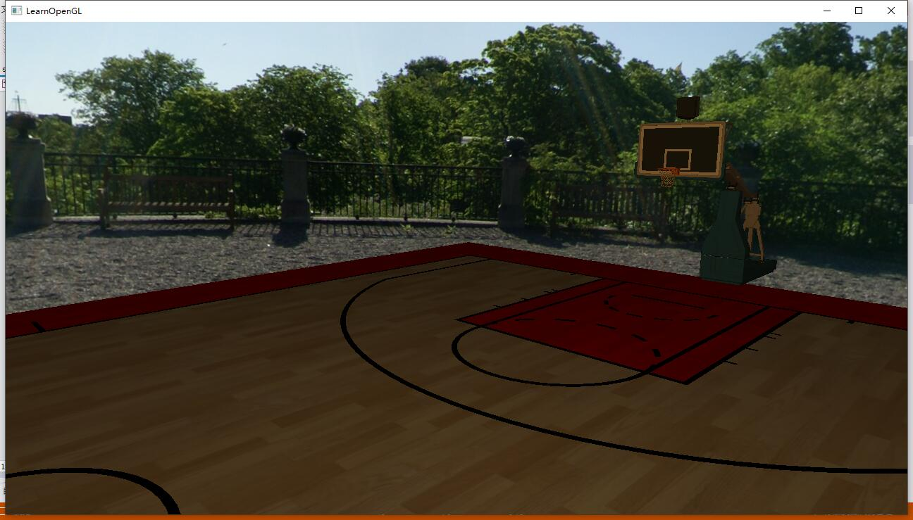

# CG FInal Report

在本次课程项目中，我主要负责完成以下几个功能模块：

- Camera Roaming；
- Model import & Mesh viewing；
- Skeletal Animation；

下面分别讲解以上功能实现的原理：

## Camera Roaming

在之前的作业中，我们已经实现过一个类似于FPS的摄像机，下面我们来回顾一下其中的几个基本概念：

- **LookAt**矩阵：

  在坐标空间变换中，我们可以通过LookAt矩阵乘以任何向量来将其变换到目标的坐标空间。在摄像机中，LookAt矩阵作为观察矩阵可以很高效地把所有世界坐标变换到刚刚定义的观察空间。

- **欧拉角(Euler Angle)**：

  欧拉角是可以表示3D空间中任何旋转的3个值，一共有3种欧拉角：俯仰角(Pitch)、偏航角(Yaw)和滚转角(Roll)：

  

### 摄像机变量

我们要实现一个摄像机，需要定义以下的几个基础变量：

```c++
// Defines several possible options for camera movement. Used as abstraction to stay away from window-system specific input methods
enum Camera_Movement {
	FORWARD,
	BACKWARD,
	LEFT,
	RIGHT
};

// Default camera values
const float YAW = -90.0f;
const float PITCH = 0.0f;
const float SPEED = 2.5f;
const float SENSITIVITY = 0.1f;
const float ZOOM = 45.0f;

class Camera
{
public:
	// Camera Attributes
	glm::vec3 Position;
	glm::vec3 Front;
	glm::vec3 Up;
	glm::vec3 Right;
	glm::vec3 WorldUp;
	// Euler Angles
	float Yaw;
	float Pitch;
	// Camera options
	float MovementSpeed;
	float MouseSensitivity;
	float Zoom;
    //...
}
```

### 构造函数

我们可以通过向量、标量两种方式构造一个摄像机，在构造函数中初始化摄像机的位置、上轴、俯仰角、偏航角；

```c++
Camera::Camera(glm::vec3 position, glm::vec3 up, float yaw, float pitch) : Front(glm::vec3(0.0f, 0.0f, -1.0f)), MovementSpeed(SPEED), MouseSensitivity(SENSITIVITY), Zoom(ZOOM)
{
	Position = position;
	WorldUp = up;
	Yaw = YAW;
	Pitch = PITCH;
	updateCameraVectors();
}

// Constructor with scalar values
Camera::Camera(float posX, float posY, float posZ, float upX, float upY, float upZ, float yaw, float pitch) : Front(glm::vec3(0.0f, 0.0f, -1.0f)), MovementSpeed(SPEED), MouseSensitivity(SENSITIVITY), Zoom(ZOOM)
{
	Position = glm::vec3(posX, posY, posZ);
	WorldUp = glm::vec3(upX, upY, upZ);
	Yaw = yaw;
	Pitch = pitch;
	updateCameraVectors();
}
```

### 观察矩阵

在摄像机系统中，通过`GetViewMatrix`方法得到观察矩阵：

```c++
glm::mat4 Camera::GetViewMatrix()
{
	return glm::lookAt(Position, Position + Front, Up);
}
```

### 自由移动

我们希望通过**WASD**键来自己移动摄像机，需要在摄像机类中添加`ProcessKeyboard`方法控制摄像机移动并能够实时更新摄像机的位置；

- 前后移动：位置向量加上或减去方向向量；
- 左右移动：使用叉乘来创建一个右向量，并沿着它相应移动；

```c++
void Camera::ProcessKeyboard(Camera_Movement direction, float deltaTime)
{
	float velocity = MovementSpeed * deltaTime;
	if (direction == FORWARD)
		Position += Front * velocity;
	if (direction == BACKWARD)
		Position -= Front * velocity;
	if (direction == LEFT)
		Position -= Right * velocity;
	if (direction == RIGHT)
		Position += Right * velocity;
}
```

另外，还需要在主函数中修改`processInput`函数，添加几个需要检查的按键命令：

```c++
void processInput(GLFWwindow *window)
{
	if (glfwGetKey(window, GLFW_KEY_ESCAPE) == GLFW_PRESS)
		glfwSetWindowShouldClose(window, true);

	if (glfwGetKey(window, GLFW_KEY_W) == GLFW_PRESS)
		camera.ProcessKeyboard(FORWARD, deltaTime);
	if (glfwGetKey(window, GLFW_KEY_S) == GLFW_PRESS)
		camera.ProcessKeyboard(BACKWARD, deltaTime);
	if (glfwGetKey(window, GLFW_KEY_A) == GLFW_PRESS)
		camera.ProcessKeyboard(LEFT, deltaTime);
	if (glfwGetKey(window, GLFW_KEY_D) == GLFW_PRESS)
		camera.ProcessKeyboard(RIGHT, deltaTime);
}
```

在处理摄像机的移动速度时，我们需要跟踪一个时间差(`Deltatime`)变量来使得我们的摄像机系统更加流畅，这个变量储存了渲染上一帧所用的时间。我们把所有速度都去乘以deltaTime值。如果我们的deltaTime很大，就意味着上一帧的渲染花费了更多时间，所以这一帧的速度需要变得更高来平衡渲染所花去的时间。

我们跟踪两个全局变量来计算出`deltaTime`值：

```c++
// timing
float deltaTime = 0.0f;	// time between current frame and last frame
float lastFrame = 0.0f;
```

在每一帧中我们计算出新的`deltaTime`：

```c++
// per-frame time logic
float currentFrame = glfwGetTime();
deltaTime = currentFrame - lastFrame;
lastFrame = currentFrame;
```

### 视角移动

偏航角和俯仰角是通过鼠标（或手柄）移动获得的，水平的移动影响偏航角，竖直的移动影响俯仰角。它的原理就是，储存上一帧鼠标的位置，在当前帧中我们当前计算鼠标位置与上一帧的位置相差多少。如果水平/竖直差别越大那么俯仰角或偏航角就改变越大，也就是摄像机需要移动更多的距离。

为了计算俯仰角和偏航角，我们需要监听鼠标移动事件，通过使用一个回调函数来完成：

```c++
void mouse_callback(GLFWwindow* window, double xpos, double ypos)
{
	if (firstMouse)
	{
		lastX = xpos;
		lastY = ypos;
		firstMouse = false;
	}

	float xoffset = xpos - lastX;
	float yoffset = lastY - ypos; // reversed since y-coordinates go from bottom to top

	lastX = xpos;
	lastY = ypos;

	camera.ProcessMouseMovement(xoffset, yoffset);
}
```

在处理FPS风格摄像机的鼠标输入的时候，我们必须在最终获取方向向量之前做下面这几步：

- 计算鼠标距上一帧的偏移量；
- 把偏移量添加到摄像机的俯仰角和偏航角中；
- 对偏航角和俯仰角进行最大和最小值的限制；
- 计算方向向量：

```c++
void Camera::ProcessMouseMovement(float xoffset, float yoffset)
{
	xoffset *= MouseSensitivity;
	yoffset *= MouseSensitivity;

	Yaw += xoffset;
	Pitch += yoffset;

	// Make sure that when pitch is out of bounds, screen doesn't get flipped
	if (Pitch > 89.0f)
		Pitch = 89.0f;
	if (Pitch < -89.0f)
		Pitch = -89.0f;

	// Update Front, Right and Up Vectors using the updated Euler angles
	updateCameraVectors();
}
```

### 缩放

另外，我们还可以在摄像机系统中实现一个缩放接口，通过鼠标的滚轮来操控：

```c++
void Camera::ProcessMouseScroll(float yoffset)
{
	if (Zoom >= 1.0f && Zoom <= 45.0f)
		Zoom -= yoffset;
	if (Zoom <= 1.0f)
		Zoom = 1.0f;
	if (Zoom >= 45.0f)
		Zoom = 45.0f;
}
```

效果：


## Model import & Mesh viewing

这里我们使用Assimp模型导入库来加载模型。使用Assimp导入一个模型的时候，它通常会将整个模型加载进一个**场景**(Scene)对象，它会包含导入的模型/场景中的所有数据。Assimp会将场景载入为一系列的节点(Node)，每个节点包含了场景对象中所储存数据的索引，每个节点都可以有任意数量的子节点。我们将要导入的模型加载到Scene对象中，遍历节点，获取对应的Mesh对象，并处理每个Mesh对象来获取顶点数据、索引以及它的材质属性。最终得到一系列的网格数据，然后将它们包含在`Model`对象中。

### Mesh类

我们需要先实现一个Mesh类，在这个类的构造器中，我们将所有必须的数据赋予给网格，然后在`setupMesh`函数中初始化缓冲，并最终使用`Draw`函数来绘制网格。

首先定义一个网格的基本数据，包括顶点、材质、纹理：

```c++
struct Vertex {
	// position
	glm::vec3 Position;
	// normal
	glm::vec3 Normal;
	// texCoords
	glm::vec2 TexCoords;
	// tangent
	glm::vec3 Tangent;
	// bitangent
	glm::vec3 Bitangent;
};

struct Material {
	//²ÄÖÊÑÕÉ«¹âÕÕ
	glm::vec4 Ka;
	//Âþ·´Éä
	glm::vec4 Kd;
	//¾µ·´Éä
	glm::vec4 Ks;
};

struct Texture {
	unsigned int id;
	string type;
	string path;
};
```

然后配置缓冲，并通过顶点属性指针定义顶点着色器的布局，这一步在`setupMesh`函数中实现：

```c++
void Mesh::setupMesh()
{
	// create buffers/arrays
	glGenVertexArrays(1, &VAO);
	glGenBuffers(1, &VBO);
	glGenBuffers(1, &EBO);
	glGenBuffers(1, &uniformBlockIndex);

	glBindVertexArray(VAO);
	// load data into vertex buffers
	glBindBuffer(GL_ARRAY_BUFFER, VBO);
	// A great thing about structs is that their memory layout is sequential for all its items.
	// The effect is that we can simply pass a pointer to the struct and it translates perfectly to a glm::vec3/2 array which
	// again translates to 3/2 floats which translates to a byte array.
	glBufferData(GL_ARRAY_BUFFER, vertices.size() * sizeof(Vertex) + sizeof(mats), &vertices[0], GL_STATIC_DRAW);
	glBindBuffer(GL_UNIFORM_BUFFER, uniformBlockIndex);
	glBufferData(GL_UNIFORM_BUFFER, sizeof(mats), (void*)(&mats), GL_STATIC_DRAW);

	glBindBuffer(GL_ELEMENT_ARRAY_BUFFER, EBO);
	glBufferData(GL_ELEMENT_ARRAY_BUFFER, indices.size() * sizeof(unsigned int), &indices[0], GL_STATIC_DRAW);

	// set the vertex attribute pointers
	// vertex Positions
	glEnableVertexAttribArray(0);
	glVertexAttribPointer(0, 3, GL_FLOAT, GL_FALSE, sizeof(Vertex), (void*)0);
	// vertex normals
	glEnableVertexAttribArray(1);
	glVertexAttribPointer(1, 3, GL_FLOAT, GL_FALSE, sizeof(Vertex), (void*)offsetof(Vertex, Normal));
	// vertex texture coords
	glEnableVertexAttribArray(2);
	glVertexAttribPointer(2, 2, GL_FLOAT, GL_FALSE, sizeof(Vertex), (void*)offsetof(Vertex, TexCoords));
	// vertex tangent
	glEnableVertexAttribArray(3);
	glVertexAttribPointer(3, 3, GL_FLOAT, GL_FALSE, sizeof(Vertex), (void*)offsetof(Vertex, Tangent));
	// vertex bitangent
	glEnableVertexAttribArray(4);
	glVertexAttribPointer(4, 3, GL_FLOAT, GL_FALSE, sizeof(Vertex), (void*)offsetof(Vertex, Bitangent));

}
```

最后开始渲染，这一步在`Draw`函数中实现：

```c++
// render the mesh
void Mesh::Draw(Shader shader)
{
	// bind appropriate textures
	unsigned int diffuseNr = 1;
	unsigned int specularNr = 1;
	unsigned int normalNr = 1;
	unsigned int heightNr = 1;
	for (unsigned int i = 0; i < textures.size(); i++)
	{
		glActiveTexture(GL_TEXTURE0 + i); // active proper texture unit before binding
										  // retrieve texture number (the N in diffuse_textureN)
		string number;
		string name = textures[i].type;
		if (name == "texture_diffuse")
			number = std::to_string(diffuseNr++);
		else if (name == "texture_specular")
			number = std::to_string(specularNr++); // transfer unsigned int to stream
		else if (name == "texture_normal")
			number = std::to_string(normalNr++); // transfer unsigned int to stream
		else if (name == "texture_height")
			number = std::to_string(heightNr++); // transfer unsigned int to stream

												 // now set the sampler to the correct texture unit

		glUniform1i(glGetUniformLocation(shader.ID, (name + number).c_str()), i);
		// and finally bind the texture
		glBindTexture(GL_TEXTURE_2D, textures[i].id);
	}

	// draw mesh
	glBindVertexArray(VAO);
	glBindBufferRange(GL_UNIFORM_BUFFER, 0, uniformBlockIndex, 0, sizeof(Material));
	glDrawElements(GL_TRIANGLES, indices.size(), GL_UNSIGNED_INT, 0);
	glBindVertexArray(0);

	// always good practice to set everything back to defaults once configured.
	glActiveTexture(GL_TEXTURE0);
}
```

### Model类

首先我们需要通过使用Assimp加载模型，需要声明Assimp命名空间内的一个Importer，然后调用它的ReadFile函数：

```c++
void Model::loadModel(string const &path)
{
	// read file via ASSIMP
	Assimp::Importer importer;
	const aiScene* scene = importer.ReadFile(path, aiProcess_Triangulate | aiProcess_FlipUVs | aiProcess_CalcTangentSpace);
	// check for errors
	if (!scene || scene->mFlags & AI_SCENE_FLAGS_INCOMPLETE || !scene->mRootNode) // if is Not Zero
	{
		cout << "ERROR::ASSIMP:: " << importer.GetErrorString() << endl;
		return;
	}
	// retrieve the directory path of the filepath
	directory = path.substr(0, path.find_last_of('/'));

	// process ASSIMP's root node recursively
	processNode(scene->mRootNode, scene);
}
```

加载模型成功后，需要处理场景中的所有节点，将第一个节点（根节点）传入递归的`processNode`函数。每个节点包含了一系列的网格索引，每个索引指向场景对象中的那个特定网格。我们接下来就想去获取这些网格索引，获取每个网格，处理每个网格，接着对每个节点的子节点重复这一过程：

```c++
void Model::processNode(aiNode *node, const aiScene *scene)
{
	// process each mesh located at the current node
	for (unsigned int i = 0; i < node->mNumMeshes; i++)
	{
		// the node object only contains indices to index the actual objects in the scene. 
		// the scene contains all the data, node is just to keep stuff organized (like relations between nodes).
		aiMesh* mesh = scene->mMeshes[node->mMeshes[i]];
		meshes.push_back(processMesh(mesh, scene));
	}
	// after we've processed all of the meshes (if any) we then recursively process each of the children nodes
	for (unsigned int i = 0; i < node->mNumChildren; i++)
	{
		processNode(node->mChildren[i], scene);
	}
}
```

紧接着需要将Assimp的数据解析到之前创建的Mesh类中，处理网格的过程主要有三部分：获取所有的顶点数据，获取它们的网格索引，并获取相关的材质数据。处理后的数据将会储存在`vector`当中，我们会利用它们构建一个Mesh对象，并返回它到函数的调用者那里：

```c++
Mesh Model::processMesh(aiMesh *mesh, const aiScene *scene)
{
	// data to fill
	vector<Vertex> vertices;
	vector<unsigned int> indices;
	vector<Texture> textures;

	// Walk through each of the mesh's vertices
	for (unsigned int i = 0; i < mesh->mNumVertices; i++)
	{
		Vertex vertex;
		glm::vec3 vector; 
		vector.x = mesh->mVertices[i].x;
		vector.y = mesh->mVertices[i].y;
		vector.z = mesh->mVertices[i].z;
		vertex.Position = vector;
		// normals
		vector.x = mesh->mNormals[i].x;
		vector.y = mesh->mNormals[i].y;
		vector.z = mesh->mNormals[i].z;
		vertex.Normal = vector;
		// texture coordinates
		if (mesh->mTextureCoords[0]) // does the mesh contain texture coordinates?
		{
			glm::vec2 vec;
			vec.x = mesh->mTextureCoords[0][i].x;
			vec.y = mesh->mTextureCoords[0][i].y;
			vertex.TexCoords = vec;
		}
		else
			vertex.TexCoords = glm::vec2(0.0f, 0.0f);
		// tangent
		vector.x = mesh->mTangents[i].x;
		vector.y = mesh->mTangents[i].y;
		vector.z = mesh->mTangents[i].z;
		vertex.Tangent = vector;
		// bitangent
		vector.x = mesh->mBitangents[i].x;
		vector.y = mesh->mBitangents[i].y;
		vector.z = mesh->mBitangents[i].z;
		vertex.Bitangent = vector;
		vertices.push_back(vertex);
	}
	for (unsigned int i = 0; i < mesh->mNumFaces; i++)
	{
		aiFace face = mesh->mFaces[i];
		// retrieve all indices of the face and store them in the indices vector
		for (unsigned int j = 0; j < face.mNumIndices; j++)
			indices.push_back(face.mIndices[j]);
	}
	// process materials
	aiMaterial* material = scene->mMaterials[mesh->mMaterialIndex];
	Material mat;
	aiColor3D color;
	material->Get(AI_MATKEY_COLOR_AMBIENT, color);
	mat.Ka = glm::vec4(color.r, color.g, color.b, 1.0);
	material->Get(AI_MATKEY_COLOR_DIFFUSE, color);
	mat.Kd = glm::vec4(color.r, color.g, color.b, 1.0);
	material->Get(AI_MATKEY_COLOR_SPECULAR, color);
	mat.Ks = glm::vec4(color.r, color.g, color.b, 1.0);
	// 1. diffuse maps
	vector<Texture> diffuseMaps = loadMaterialTextures(material, aiTextureType_DIFFUSE, "texture_diffuse");
	textures.insert(textures.end(), diffuseMaps.begin(), diffuseMaps.end());
	// 2. specular maps
	vector<Texture> specularMaps = loadMaterialTextures(material, aiTextureType_SPECULAR, "texture_specular");
	textures.insert(textures.end(), specularMaps.begin(), specularMaps.end());
	// 3. normal maps
	std::vector<Texture> normalMaps = loadMaterialTextures(material, aiTextureType_HEIGHT, "texture_normal");
	textures.insert(textures.end(), normalMaps.begin(), normalMaps.end());
	// 4. height maps
	std::vector<Texture> heightMaps = loadMaterialTextures(material, aiTextureType_AMBIENT, "texture_height");
	textures.insert(textures.end(), heightMaps.begin(), heightMaps.end());
	// return a mesh object created from the extracted mesh data
	return Mesh(vertices, indices, textures, mat);
}
```

然后我们需要加载网格的漫反射和/或镜面光贴图。一个材质对象的内部对每种纹理类型都存储了一个纹理位置数组。不同的纹理类型都以`aiTextureType_`为前缀。我们使用一个叫做`loadMaterialTextures`的工具函数来从材质中获取纹理。`loadMaterialTextures`函数遍历了给定纹理类型的所有纹理位置，获取了纹理的文件位置，并加载并和生成了纹理，将信息储存在了一个`Vertex`结构体中：

```c++
vector<Texture> Model::loadMaterialTextures(aiMaterial *mat, aiTextureType type, string typeName)
{
	vector<Texture> textures;
	for (unsigned int i = 0; i < mat->GetTextureCount(type); i++)
	{
		aiString str;
		mat->GetTexture(type, i, &str);
		// check if texture was loaded before and if so, continue to next iteration: skip loading a new texture
		bool skip = false;
		for (unsigned int j = 0; j < textures_loaded.size(); j++)
		{
			if (std::strcmp(textures_loaded[j].path.data(), str.C_Str()) == 0)
			{
				textures.push_back(textures_loaded[j]);
				skip = true; // a texture with the same filepath has already been loaded, continue to next one. (optimization)
				break;
			}
		}
		if (!skip)
		{   // if texture hasn't been loaded already, load it
			Texture texture;
			texture.id = TextureFromFile(str.C_Str(), this->directory);
			texture.type = typeName;
			texture.path = str.C_Str();
			textures.push_back(texture);
			textures_loaded.push_back(texture);  // store it as texture loaded for entire model, to ensure we won't unnecesery load duplicate textures.
		}
	}
	return textures;
}
```

效果：



## Skeletal Animation

骨骼动画的实现参见教程：[Skeletal Animation With Assimp](http://ogldev.atspace.co.uk/www/tutorial38/tutorial38.html)

Assimp数据结构中，aiMesh 中还包含了一个 aiBone 对象数组，一个 aiBone 对象代表了网格骨架中的一个骨骼，每个骨骼都有一个名字这样就能通过名字在骨骼层次中找到对应的骨骼，每个骨骼对象中还存放了一个顶点权重数组和一个 4 x 4 的偏移矩阵。顶点权重数组中的每一个元素里都保存了一个顶点索引以及一个权重值，这个索引与 aiMesh 中的顶点数组中的元素对应。同一个顶点的所有权重之和必须为1。

aiScene 对象中保存了一个指向 aiNode 的指针，这个指针所指向的对象就是整个骨骼树的根节点，骨骼树中的每一个节点都保存了一个指向其父节点的指针和一个保存其所有子节点指针的数组。这使得我们能够十分方便的对这个树进行前向和后向的遍历。此外节点中还保存了一个从当前骨骼空间变换到其父节点空间的变换矩阵。

在 aiScene 对象中还保存了一个aiAnimation 数组，每一个 aiAnimation 对象都表示一个动画帧序列，通过在关键帧之间插值，我们就可以得到与当前动作像匹配的视觉效果。一个 aiAnimation 节点中保存了一个用 tick 计数的持续时间，以及每秒的 tick 数，这使得我们能在不同的硬件平台上保持动画表现的一致性。此外每一个元素中还有一个 aiNodeAnim 对象数组，数组名为 channels 。数组中的每一个元素中存放的实际上就是一个骨骼的变换信息，这些信息里面同样保存了一个骨骼名字符串和三个分别表示缩放、旋转、平移的数组。

为了计算出某个时刻骨骼最终的变换矩阵，我们需要根据当前时间对关键帧之间三个变换数组进行插值，并将这些变换组合成一个矩阵。这些完成之后我们需要在骨骼树种找到对应的骨骼节点并遍历其父节点，之后我们对它的每个父节点都做同样的插值处理，并将这些变换矩阵乘起来即可。

下面我们逐步讲解骨骼动画的代码实现：

首先定义骨骼的基本信息：

```c++
struct BoneInfo {
  Matrix4f BoneOffset;
  Matrix4f FinalTransformation;

  BoneInfo() {
    BoneOffset.SetZero();
    FinalTransformation.SetZero();
  }
};

struct VertexBoneData {
  uint IDs[NUM_BONES_PER_VEREX];
  float Weights[NUM_BONES_PER_VEREX];

  VertexBoneData() {
    Reset();
  };

  void Reset() {
    ZERO_MEM(IDs);
    ZERO_MEM(Weights);
  }
  void AddBoneData(uint BoneID, float Weight);
};
```

修改Mesh类的入口函数：

```c++
bool AnimationMesh::LoadMesh(const string &Filename) {
    // Release the previously loaded mesh (if it exists)
    Clear();

    // Create the VAO
    glGenVertexArrays(1, &m_VAO);
    glBindVertexArray(m_VAO);

    // Create the buffers for the vertices attributes
    glGenBuffers(ARRAY_SIZE_IN_ELEMENTS(m_Buffers), m_Buffers);

    bool Ret = false;

    m_pScene = m_Importer.ReadFile(Filename.c_str(),
                                   aiProcess_Triangulate | aiProcess_GenSmoothNormals | aiProcess_FlipUVs);

    if (m_pScene) {
        m_GlobalInverseTransform = m_pScene->mRootNode->mTransformation;
        m_GlobalInverseTransform.Inverse();
        Ret = InitFromScene(m_pScene, Filename);
    } else {
        printf("Error parsing '%s': '%s'\n", Filename.c_str(), m_Importer.GetErrorString());
    }

    // Make sure the VAO is not changed from the outside
    glBindVertexArray(0);

    return Ret;
}
```

然后导入 aiMesh 对象中的顶点的骨骼数据，这个函数在 Mesh::InitMesh() 中调用，除了初始化每个顶点的 VertexBoneData 结构体中的数据之外它还会更新一个存放骨骼名和骨骼 ID 的 map 结构（由这个函数管理的骨骼名和骨骼 ID 之间的索引），并保存骨骼的偏移矩阵：

```c++
void AnimationMesh::LoadBones(uint MeshIndex, const aiMesh *pMesh, vector<VertexBoneData> &Bones) {
    for (uint i = 0; i < pMesh->mNumBones; i++) {
        uint BoneIndex = 0;
        string BoneName(pMesh->mBones[i]->mName.data);

        if (m_BoneMapping.find(BoneName) == m_BoneMapping.end()) {
            // Allocate an index for a new bone
            BoneIndex = m_NumBones;
            m_NumBones++;
            BoneInfo bi;
            m_BoneInfo.push_back(bi);
            m_BoneInfo[BoneIndex].BoneOffset = pMesh->mBones[i]->mOffsetMatrix;
            m_BoneMapping[BoneName] = BoneIndex;
        } else {
            BoneIndex = m_BoneMapping[BoneName];
        }

        for (uint j = 0; j < pMesh->mBones[i]->mNumWeights; j++) {
            uint VertexID = m_Entries[MeshIndex].BaseVertex + pMesh->mBones[i]->mWeights[j].mVertexId;
            float Weight = pMesh->mBones[i]->mWeights[j].mWeight;
            Bones[VertexID].AddBoneData(BoneIndex, Weight);
        }
    }
}
```

遍历 VertexBoneData 结构体中数组的每一个元素，直到找到一个没有存放数据的元素并将骨骼 ID 和权重值存到里面：

```c++
void AnimationMesh::VertexBoneData::AddBoneData(uint BoneID, float Weight) {
    for (uint i = 0; i < ARRAY_SIZE_IN_ELEMENTS(IDs); i++) {
        if (Weights[i] == 0.0) {
            IDs[i] = BoneID;
            Weights[i] = Weight;
            return;
        }
    }
}
```

接着计算每一帧中传入到着色器中的骨骼变换矩阵。在这个函数中需要将当前时间以秒的形式传递进去，并提供一个矩阵向量作为输出参数。通过传入的时间在动作循环中查找相关的关键帧并对整个骨骼树进行更新，并将更新之后的矩阵信息传递给调用函数：

```c++
void AnimationMesh::ReadNodeHeirarchy(float AnimationTime, const aiNode *pNode, const Matrix4f &ParentTransform) {
    string NodeName(pNode->mName.data);

    const aiAnimation *pAnimation = m_pScene->mAnimations[0];

    Matrix4f NodeTransformation(pNode->mTransformation);

    const aiNodeAnim *pNodeAnim = FindNodeAnim(pAnimation, NodeName);

    if (pNodeAnim) {
        // Interpolate scaling and generate scaling transformation matrix
        aiVector3D Scaling;
        CalcInterpolatedScaling(Scaling, AnimationTime, pNodeAnim);
        Matrix4f ScalingM;
        ScalingM.InitScaleTransform(Scaling.x, Scaling.y, Scaling.z);

        // Interpolate rotation and generate rotation transformation matrix
        aiQuaternion RotationQ;
        CalcInterpolatedRotation(RotationQ, AnimationTime, pNodeAnim);
        Matrix4f RotationM = Matrix4f(RotationQ.GetMatrix());

        // Interpolate translation and generate translation transformation matrix
        aiVector3D Translation;
        CalcInterpolatedPosition(Translation, AnimationTime, pNodeAnim);
        Matrix4f TranslationM;
        TranslationM.InitTranslationTransform(Translation.x, Translation.y, Translation.z);

        // Combine the above transformations
        NodeTransformation = TranslationM * RotationM * ScalingM;
    }

    Matrix4f GlobalTransformation = ParentTransform * NodeTransformation;

    if (m_BoneMapping.find(NodeName) != m_BoneMapping.end()) {
        uint BoneIndex = m_BoneMapping[NodeName];
        m_BoneInfo[BoneIndex].FinalTransformation =
                m_GlobalInverseTransform * GlobalTransformation * m_BoneInfo[BoneIndex].BoneOffset;
    }

    for (uint i = 0; i < pNode->mNumChildren; i++) {
        ReadNodeHeirarchy(AnimationTime, pNode->mChildren[i], GlobalTransformation);
    }
}
```

然后根据运动时间对某一个动作序列的旋转、平移、缩放四元数进行插值，一般是首先我们找到关键帧的索引，这个关键帧刚好是我们所需要的动画时间的前一个。之后我们计算当前动画时间在其前一个关键帧发生的时间和后一个关键帧时间之间比例，并通过这个比例在两个关键帧之间进行插值：

```c++
uint AnimationMesh::FindRotation(float AnimationTime, const aiNodeAnim *pNodeAnim) {
    assert(pNodeAnim->mNumRotationKeys > 0);

    for (uint i = 0; i < pNodeAnim->mNumRotationKeys - 1; i++) {
        if (AnimationTime < (float) pNodeAnim->mRotationKeys[i + 1].mTime) {
            return i;
        }
    }

    assert(0);

    return 0;
}
```

效果：

